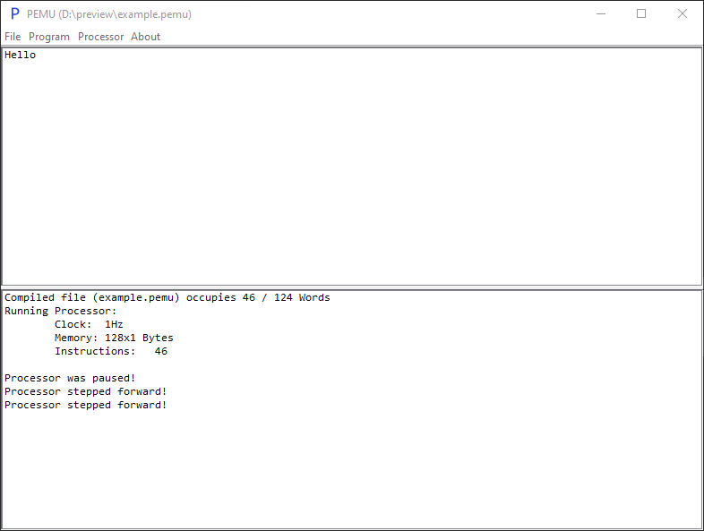
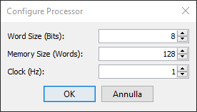
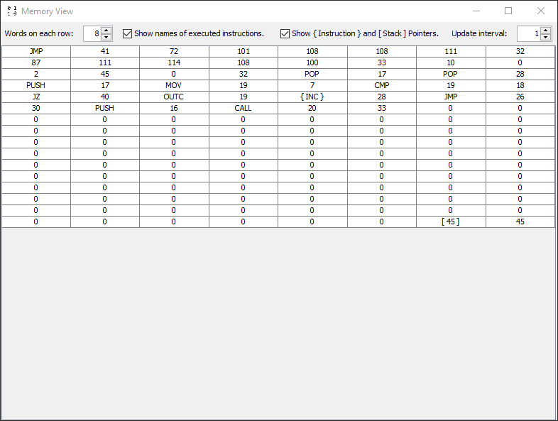

# Processor Emulator

## What's this project all about?

One day I woke up and decided to challenge myself.
So this project came to life, it's a short story but full of headaches.
Don't expect much from this emulator, it's made just for learning purposes.

## Does this program create any files on disk?

~~From version `1.0.0` this program creates one file named `PEMU.config` in the user's home dir to save all config data.~~

From version `1.12.0` this program creates a folder named `PEMU` in the user's home dir to store all program's data.

 - Windows: `%USERPROFILE%/PEMU/`
 - Linux: `$HOME/PEMU/`

## How to run:

This project is built using [**Adopt OpenJDK 8**](https://adoptopenjdk.net/?variant=openjdk8&jvmVariant=hotspot),
though any newer JRE should be able to run this properly.

There are four main ways to run it:
 1. By downloading the jar file from [Releases](https://github.com/hds536jhmk/ProcessorEmulator/releases).
 2. By opening the project using **IntelliJ IDEA** and building the **project's artifact**.
 3. By opening the project using **IntelliJ IDEA** and creating a new **Run Config**:
    - Java Version: `1.8` (Adopt OpenJDK)
    - Class Path: `Processor_Emulator.main`
    - Main Class: `io.github.hds.pemu.Main`
 4. By building the source with gradle. Pull the latest version from the repo and run `gradlew build`,
    the jar file should be located in `./build/libs/PEMU-version.jar`.

## Examples:

PEMU Program Examples can be found in the [examples](https://github.com/hds536jhmk/ProcessorEmulator/tree/master/examples)
folder.

## PEMU Libraries:

Since version `1.10.0` added the `#INCLUDE` Compiler Instruction (see [docs](#documentation)) libraries became possible,
so I've made a [Standard Library](https://github.com/hds536jhmk/pemu-stdlib) Which is separated
into modules (since Memory Management is so important) with all functions that I've found myself rewriting all the time.

You can download the above linked folder and start using it yourself to make your life much easier!

## Documentation:

Can be found in the file [DOCUMENTATION.md](https://github.com/hds536jhmk/ProcessorEmulator/blob/master/DOCUMENTATION.md)

## Plugins:

On version `1.12.0` plugin support was added, and since then you can write your own implementation of a Processor using
the Ruby Programming Language (This added support also increased PEMU's size by ~25MB).

On version `1.13.0` Native Plugin support was added, so now Plugins written in Java can be used.

You can learn more about plugins in the [plugins](https://github.com/hds536jhmk/ProcessorEmulator/tree/master/plugins)
folder.

## Utilities:

### vscode-pemu-language

There's a VSCode Extension which currently adds Code Check (Through the "Verify PEMU Code" Command), Code Snippets,
Syntax Highlighting (For PEMU Docs too!), Icons (Still waiting for VSCode to support extending other themes) and other
utilities to be used with the PEMU Programming Language:

 - https://marketplace.visualstudio.com/items?itemName=hds.pemu-language-extensions
 - https://github.com/hds536jhmk/vscode-pemu-language

## Dependencies:

There are 2 main dependencies:
1. [JRuby](https://www.jruby.org) (Used to add support for Plugins written in Ruby)
2. [JetBrains Annotations](https://github.com/JetBrains/java-annotations)

## Screenshots:

The Main Window that contains the Debugging Console (the one on the bottom), and the Processor Console (where the
processor can print to on the top) and other info/settings:

The Processor Config Panel where you can change your Processor's settings
(Clock can be changed while the Processor's running):

The Memory View window where the Processor's Memory is shown to the user, this has also some visual settings:

