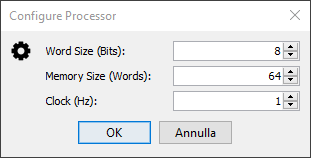
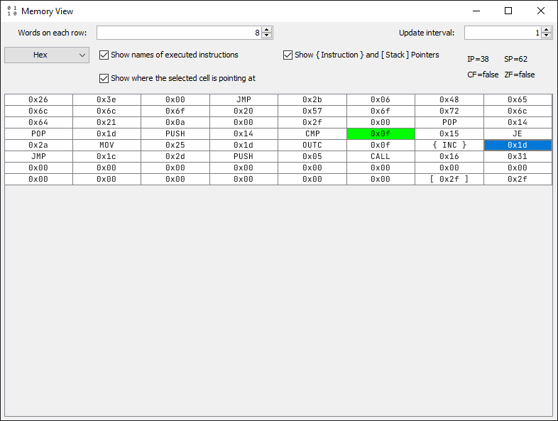

# Processor Emulator

## What's this project all about?

One day I woke up and decided to challenge myself.
So this project came to life, it's a short story but full of headaches.
Don't expect much from this emulator, it's made just for learning purposes.

## Does this program create any files on disk?

From version 1.0.0 this program creates one file named `PEMU.config` in the user's home dir to save all config data.

On Windows: `%USERPROFILE%/PEMU.config`

## How to run:

There are four main ways to run this project:
 1. By downloading the precompiled jar file and running it.
 2. By opening the project using **IntelliJ IDEA** and building the **project's artifact**.
 3. By opening the project using **IntelliJ IDEA** and creating a new **Run Config**:
    - Java Version: `1.8`
    - Class Path: `Processor_Emulator.main`
    - Main Class: `io.github.hds.pemu.Main`
 4. (**NOTE: This isn't really tested or supported**) By compiling it yourself! Download the latest version from the repo
    and run `gradlew build`, the compiled file should be located in `./build/libs/PEMU-version.jar`.

## Examples:

An example of program that the processor can run can be found [@resources/example.pemu](https://github.com/hds536jhmk/ProcessorEmulator/blob/master/src/main/resources/example.pemu)

## Documentation:

Can be found [@DOCUMENTATION.md](https://github.com/hds536jhmk/ProcessorEmulator/blob/master/DOCUMENTATION.md)

## Dependencies:

There are actually no dependencies except for `JetBrains Annotations` that's used at compile time.

## Screenshots:

The Main Window that contains the Debugging console (the one on the bottom), and the Processor console (where the
processor can print to on the top):

The Processor Config Panel:

The Memory View window, where the Processor memory is conveniently shown as a table of width specified by the user:

